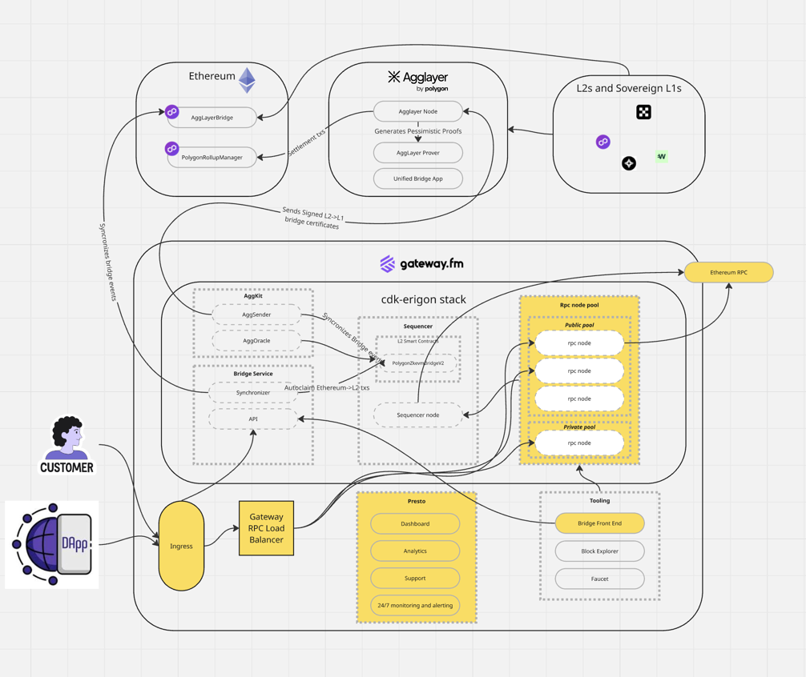

#  🛟 FAQ: Avoiding Vendor Lock-In (Gateway RaaS)
##  How to avoid vendor lock-in with Gateway’s RaaS (Presto) — FAQ

This FAQ explains how Gateway’s Rollup-as-a-Service (RaaS) is designed to avoid vendor lock-in, what you can take with you if you switch providers or go in-house, and what continuity/recovery looks like if Gateway is no longer operating your infrastructure.
**Core principle:** the **rollup network can be operated independently** because the **core rollup stack is open-source and/or deployed on public blockchain infrastructure**. Gateway’s proprietary value is primarily in **operations, automation, and managed reliability**—not in “ownership” of your chain.

<strong>Does Gateway’s RaaS create vendor lock-in?</strong>

No. Gateway’s deployments use open-source rollup components and public blockchain infrastructure such that a customer can:

- migrate to another provider
- operate the network in-house or
without needing proprietary Gateway software for the chain to exist.

---

<strong>If we want to go in-house or switch providers, what happens?</strong>

**Both offboarding paths start with the customer notifying Gateway of contract termination within the timelines and according to the termination terms defined in the contract**. After notice is received, Gateway aligns with the customer on the target offboarding date/time and the preferred transition approach.
There are two typical offboarding paths:

## Option A — Standard offboarding (normal termination / SLA offboarding)
At an agreed date/time, Gateway shuts down the managed environment and provides the materials required to continue operating the network elsewhere, typically including:

- **node snapshots** (sequencer + RPC/full nodes as applicable),
- **configuration files** required to run the network,
- and **any operational keys/credentials required for continued operation** (as applicable and contractually defined).

This package is intended to be sufficient for the customer (or a new provider) to bring the network up independently.

## Option B — Assisted migration (customer-tailored transition; professional services)
If the customer wants to minimize downtime and transition risk, Gateway can provide a tailored migration plan and work directly with the customer and/or the new provider to execute a smooth cutover (planning, runbooks, rehearsals where appropriate, production cutover support).
This is typically delivered as a separate professional services engagement outside the base contract scope and is priced based on scope and requirements.
 

---

<strong>Do you have a documented migration process?</strong>

We have an offboarding/migration process, but the exact runbook varies case-by-case depending on:
- architecture and topology (sequencer setup, node fleet, environments),
- security model (key custody, admin roles, signing/rotation),
- data strategy (snapshots, backups, retention requirements),
- acceptable downtime and cutover constraints.

A typical migration workstream includes:
- termination notice per contract,
- defining responsibilities and cutover window,
- snapshot/config export and validation,
- optional rehearsal / dry run,
- production cutover and post-cutover verification

---

<strong>Open-source vs proprietary vs third-party: what runs where?</strong>

A practical breakdown:

## A) Open-source components (core network functionality — transferable)

These are the components required to run the rollup network itself and are transferable:

- **Sequencer and node software**
- **RPC / full nodes**
- **AggKit components**
- **Bridge application**
- **Block explorer stack** (commonly Blockscout)

## B) Third-party components (typically open-source — transferable)

Gateway may deploy/operate third-party open-source components as part of the stack (transferable):
- **Polygon AggKit / bridge components**
- **Blockscout** (block explorer)

## C) Gateway proprietary components (operational enhancements and proxy-stack — not transferable)

These are not required for the chain to exist, but improve security, stability, and observability:
- **Gateway RPC load-balancing stack**
- **Monitoring / alerting / dashboards and operational automation**
- **Support tooling / operational workflows**
- Other Gateway-managed infrastructure and automation components

If you leave Gateway, you can run without these enhancements initially, or replace them with your own tooling/alternatives.

---

<strong>What is the operational impact if the contract ends?</strong>

After termination, responsibility moves to the customer (or the new provider) to operate *all* supporting infrastructure, for example:

- traffic management / RPC load balancing / rate limiting,
- monitoring, alerting, incident response,
- backups, retention, and recovery testing,
- security hardening and key-management practices.

The chain can continue—operational maturity depends on what you replace and how.

---

<strong>Architecture diagram: what is transferable vs not transferable?</strong>

Below is a **reference architecture** for a typical Gateway rollup deployment. The labeling is intentionally simple:

- **White components** = **transferable** (open-source software, public blockchain components, or standard deployable services)
- **Yellow components** = **not transferable** (Gateway proprietary software and/or Gateway-managed infrastructure setup that cannot be “handed over” as a product)

### Transferable (white) — examples from the diagram
- **cdk-erigon rollup stack components** (e.g., sequencer, node software)
- **RPC nodes** themselves (software + data can be snapshotted and moved)
- **AggKit / bridge-related services** (as OSS components)
- **Block explorer** (e.g., Blockscout deployment)
- **Bridge app (where OSS)**
- **Public blockchain dependencies** (e.g., Ethereum, AggLayer components) are not “owned” by any provider and remain accessible regardless of who operates your infrastructure

### Not transferable (yellow) — examples from the diagram
- **Gateway RPC Load Balancer**
- **Ingress layer** (Gateway-managed traffic entry and associated infra setup)
- **Presto operational layer** (Dashboard, Analytics, Support workflows, 24/7 monitoring & alerting as operated by Gateway)
- **Gateway-operated “pooling/orchestration” infra patterns** around RPC fleets (the *nodes* are transferable; the Gateway-managed pooling/orchestration layer and environment setup is not)
- **Gateway-specific tooling components** marked in yellow (e.g., the “Bridge Front End” in the reference diagram if delivered as Gateway-managed tooling)
**Important note:** exact components and boundaries can differ by deployment and contract scope. For formal reviews, Gateway can provide a deployment-specific diagram annotated with the same “transferable vs non-transferable” classification.

---

<strong>What’s the typical migration timeline and cost to move away?</strong>

**The cutover itself** can be executed **in ~1 day** (given coordinated engineering teams on both sides).

However, **planning and preparation** (runbooks, approvals, security checks, rehearsals, scheduling) often spans **up to ~1 month** depending on complexity and risk tolerance.

**Commercial model:**

- **Standard offboarding**: typically covered by normal termination/offboarding terms.
- **Assisted migration**: scoped and billed as a separate professional services engagement.

---

<strong>How long do you retain data after shutdown?</strong>

A common baseline is:

- **Up to 1 month after stopping the network**, if requested by the customer in the termination notice.

Longer retention windows are typically negotiable (storage footprint, compliance needs, and scope).

---

<strong>What happens if Gateway stops operating the infrastructure?</strong>

If Gateway-operated infrastructure goes offline:

- the network **stops producing new blocks** until the infrastructure is restored or replaced.

If all resources (servers and data volumes) were deleted without appropriate handover/backups, that can create **permanent data loss** and **TVL risk**. This is why redundancy and recoverability planning are critical.

---

<strong>Is there a recovery process for the network and assets?</strong>

Yes. A typical recovery approach relies on redundancy:

- multiple nodes maintain replicas of the sequencer/node data,
- if a node (including the sequencer) is corrupted, it can be replaced from a healthy replica and the fleet can be rehydrated,
- customers/community are encouraged to run independent nodes to increase resilience.

---

<strong>Can we recover and operate independently without Gateway support?</strong>

In many cases, yes—provided the customer has the necessary data and operational access.

**Optional resiliency path (if enabled): Blob-DA add-on**

- posts the latest transaction batches to L1 and backs up to a traditional relational database,
- is permissionless (can be run by parties other than Gateway),
- supports sequencer restore functionality from Blob-DA.

If the customer operates their own nodes and/or a Blob-DA + database backup setup, they can recover the network. They would also typically need to rotate/secure certain admin accounts on both L1 and L2 during takeover.

Gateway support is **not strictly required**, but often preferred for faster turnaround and reduced operational risk.

---

<strong>Summary</strong>

## Summary: what “no vendor lock-in” means with Gateway RaaS

- **Your rollup’s core stack is transferable** (open-source + portable state/config).
- Gateway’s proprietary parts are **operational accelerators**, not chain dependencies.
- Offboarding can be **standard (handover)** or **assisted (min downtime)**.
- Network continuity is enabled through **redundancy + recoverability options** (including optional Blob-DA backup/restore patterns).

