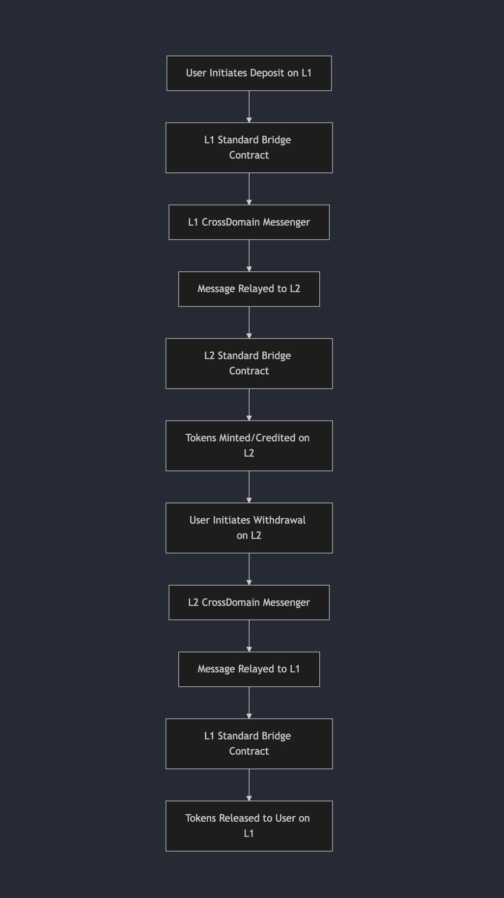

# 🛟 FAQ: Optimism (OP)

<strong>About OP</strong>

### Optimism

Optimism is a Layer 2 scaling solution for Ethereum that leverages rollup technology to bundle multiple transactions into batches before submitting them to Ethereum L1.

#### Core Components Overview

- **Sequencer** – Orders and processes transactions before batching.
- **Proposer** – Posts state roots and finalization data to L1.
- **Batcher** – Sends compressed data batches to L1 for data availability.
- **RPC Nodes** – Support horizontal scaling for high RPC traffic.

---

<strong>Setting Up an OP Rollup</strong>

### Configuration Parameters Explained

- **`batcher_max_channel_duration`**

  - **Definition**: Max duration (in L1 blocks) the batcher can keep a channel open.
  - **Purpose**: Ensures timely submission of transactions.
  - **Recommendation**: Tune based on L1 block time (~12s) and desired batching frequency.

- **`proposer_proposal_interval`**

  - **Definition**: Time interval (in seconds) for proposer submissions to L1.
  - **Purpose**: Ensures consistent L2 → L1 sync.
  - **Recommendation**: Align with `batcher_max_channel_duration`.

- **`data_availability_type`**
  - **Definition**: Method for ensuring data availability (`blobs` or `calldata`).
  - **Purpose**: Impacts scalability and cost.
  - **Recommendation**: Use `blobs` for blob storage or `calldata` for inline embedding.

---

<strong>Bridging and Token Transfers</strong>

Bridging tokens between Layer 1 (Ethereum) and Layer 2 (Optimism) allows movement of assets across layers via **deposits** (L1 → L2) and **withdrawals** (L2 → L1).

### Deposit Flow (L1 to L2)

1. **User Initiation** – Tokens sent to L1 Standard Bridge contract
2. **Message Relaying** – Handled by L1 CrossDomain Messenger
3. **L2 Credit** – Tokens minted or credited to L2 account

### Withdrawal Flow (L2 to L1)

1. **User Initiation** – Withdraw starts on L2
2. **Message Relaying** – Via L2 CrossDomain Messenger
3. **L1 Finalization** – Tokens released after challenge period

### Bridging Mechanics

- Use `OptimismPortalProxy.depositERC20Transaction`
- Ensure tokens are approved for transfer before depositing

---

<strong>Configuration (Set Before Deployment)</strong>

:::caution
These parameters **must be configured before deployment** and **cannot be changed afterward**.
:::

### Batching Parameters

- **Max Number of Batches**: `300` (default)
- **Max Batch Size**: `120,000 bytes`
- **Max Batches Per Sequence**: Default `300` (can be increased)

### Parameter Synchronization

- Align `batcher_max_channel_duration` and `proposer_proposal_interval` to prevent redundant L1 posts

### Sequencer and Batch Optimization

- **Rate Limits** – Tune based on expected RPC traffic
- **Batch Size** – Adjust to optimize L1 and L2 throughput

### Pre-Deployment Recommendations

- **Low-latency apps** → Lower timing values
- **Cost-efficient apps** → Higher values for batching efficiency

---

## 🚑 Troubleshooting

<strong>Faucet Not Sending Tokens</strong>

Common issues when claiming from the Optimism faucet:

- **Server Load** – Faucet may be under high demand
- **Insufficient Funds** – Faucet out of tokens
- **Rate Limits** – IP or wallet limits exceeded

### Solutions

- Wait and retry later
- Confirm you're connected to Optimism (L2) network
- Try an alternative testnet faucet if available

[Source: GitHub Optimism Docs Issue](https://github.com/ethereum-optimism/docs/issues/1030?utm_source=chatgpt.com)

---

<strong>Max Number of Batches Per Sequence</strong>

The **batcher** sends L2 data to L1 in compressed format. The `batcher_max_channel_duration` parameter controls batch timing.

### Key Settings

- **Default**: `0` (disabled)
- **Recommended**: Approx. **1500 L1 blocks** (~5 hours on Sepolia)

### Best Practices

- Tune duration based on usage patterns and desired cost optimization

[Source: Optimism Batcher Configuration](https://docs.optimism.io/builders/chain-operators/configuration/batcher?utm_source=chatgpt.com)

---

<strong>Resources</strong>

- [Optimism Docs](https://docs.optimism.io/)
- [OP Stack Specs](https://specs.optimism.io/)
- [Smart Contracts](https://github.com/ethereum-optimism)
- [Config Tools](https://docs.optimism.io/builders/chain-operators/management/configuration)

