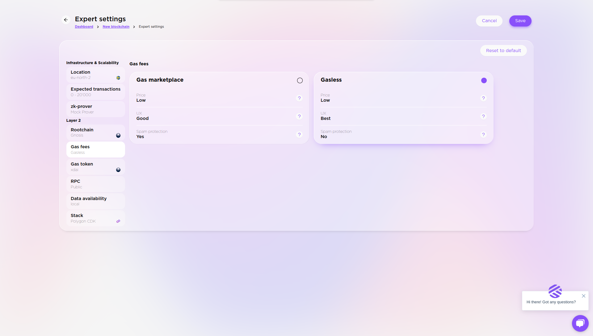

# Contact Us For Deploying a gasless rollup
[Reach out to the Gateway team to start the gasless rollup deployment process](https://presto.gateway.fm/login)

## What is a Gasless Rollup?

In a gasless rollup, users can opt-out to set up gas price to 0. That way they don’t have to even have tokens to be able to transact on the gasless blockchain.

Gas fees are covered by the user then.

Downsides of this approach is opening up to spamming the network.

1. Deploying a gasless rollup follows the same process as [How to Create a Rollup](how-to-create-a-rollup.mdx), except you select "Configure" before deployment as seen in the screenshot below.

.png)

2. In there select "Gas fees" then "Gasless" and click "Save".

