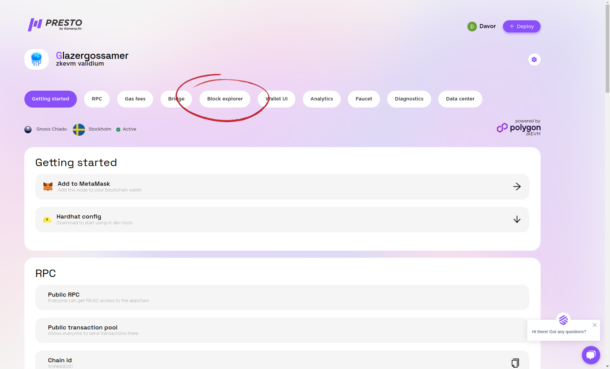
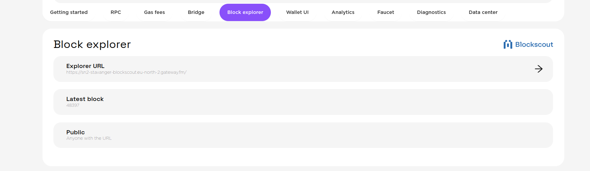
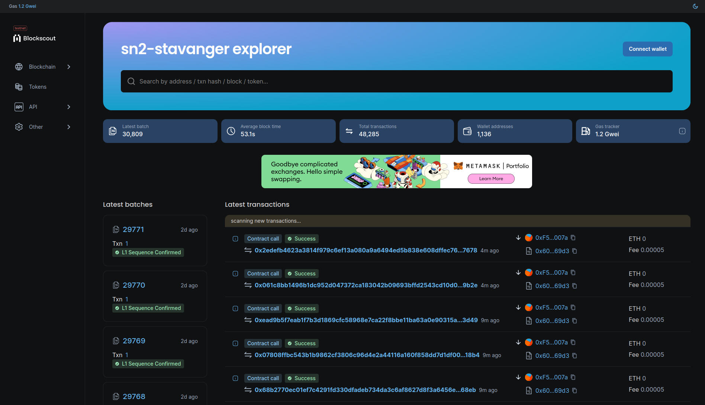

# How to Access the Block Explorer

Each Layer 2 blockchain on Presto comes with a pre-bundled block explorer, which is a powerful tool used to explore and analyze blockchain data.
Each Layer 2 blockchain on Presto comes with a pre-bundled block explorer, which is a powerful tool used to explore and analyze blockchain data.

1. Click on the Block explorer in the menu and you will be directed to the Block Explorer section. There click on -> to be directed to the blockchain explorer.

Use the block explorer to enter a transaction or block hash, explore detailed transaction or block information, navigate through the blockchain's history and check wallet balances.

