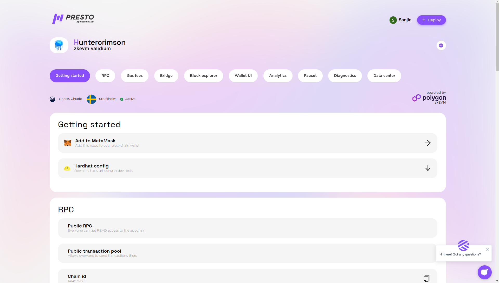
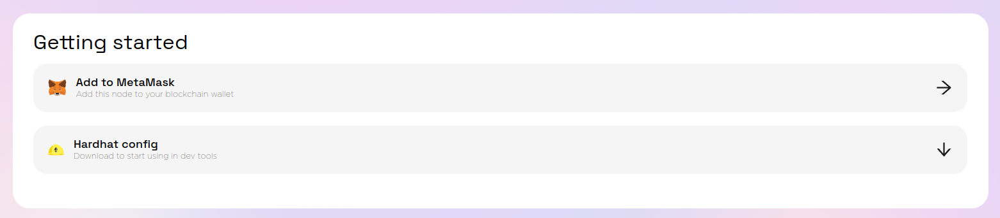
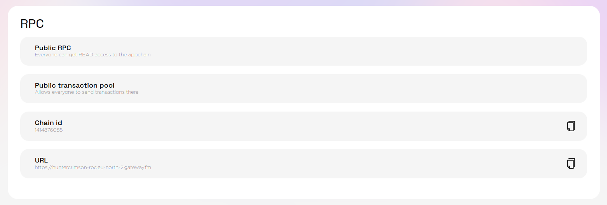
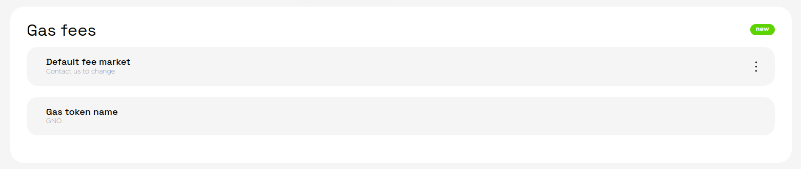
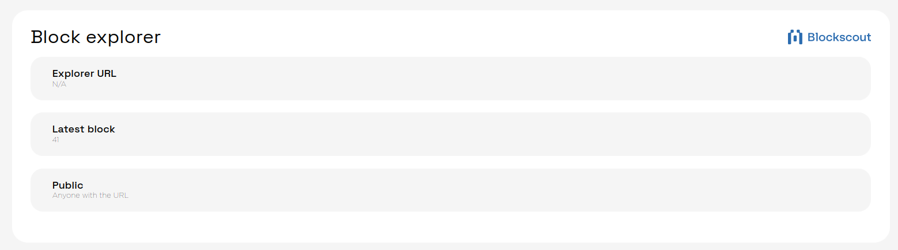
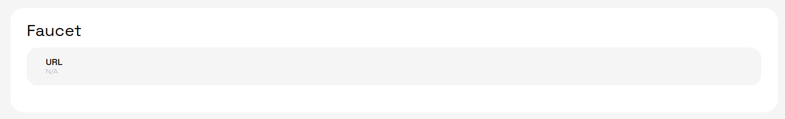
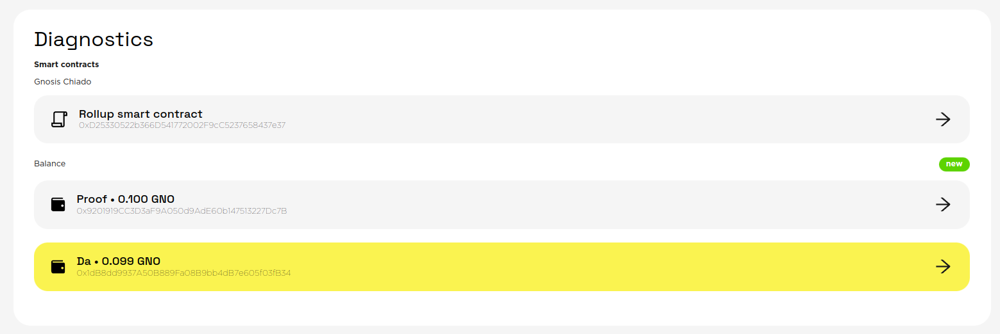

# Presto L2 Dashboard

Dashboard is your go-to place to manage and review all the information about your L2.

Top to bottom it consist of:

* name of the L2 and its type
* “gear” menu with options to delete the L2 ([How To Delete A Rollup](../main-functionality/how-to-delete-a-rollup.mdx))
* navigation strip
* rootchain, location, status and zkEVM logo
* sections

### Getting Started

Here you can add your chain to a wallet ([How to use MetaMask with Presto](https://docs-presto.gateway.fm/overview/main-functionality/how-to-use-metamask-with-presto)) and also download the config for Hardhat to deploy smart contracts ([How to use HardHat with Presto](https://docs-presto.gateway.fm/overview/features-for-developers/how-to-use-hardhat-with-presto)).

### RPC

Here is all the necessary info about the RPC, is it public or private, chain id and the RPC url.

### Gas Fees

Here is the overview and settings for the gas fees.

### Bridge

Here is the link to the UI (and visibility settings) for the LX-to-LY bridge from Polygon CDK. (See [How to use a Bridge](https://docs-presto.gateway.fm/overview/main-functionality/how-to-use-a-bridge)).

### Block Explorer

Each rollup comes with the blockscout instance. (See[ How to use a Block Explorer](https://docs-presto.gateway.fm/overview/main-functionality/how-to-use-a-block-explorer)).

### Faucet

Each testnet comes with a faucet where you can get test gas tokens for smart contract deployments.

### Diagnostics

This section contains information about smart contracts on L1.

### Data center info

basic info about the datacenter

## Enterprise customers

Enterprise customers might have extra sections or other set of sections dependent on what customizations are chosen. See ([Enterprise vs Paid — what is the difference?](broken-reference)).
